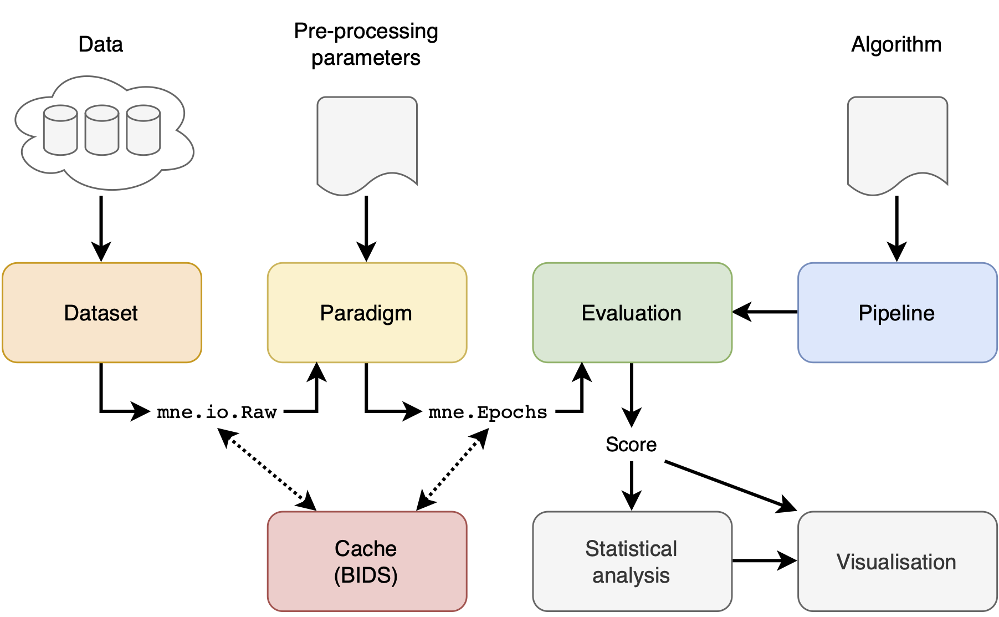

# Mother of all BCI Benchmark


## Disclaimer

**This is work in progress. API will change significantly (as well as the results of the benchmark).**

[](https://travis-ci.org/NeuroTechX/moabb)

## Welcome!

Thank you for visiting the Mother of all BCI Benchmark documentation and associated [GitHub repository](https://github.com/NeuroTechX/moabb).

This document (the README file) is a hub to give you some information about the project. Jump straight to one of the sections below, or just scroll down to find out more.

* [What are we doing? (And why?)](#what-are-we-doing)
* [Who are we?](#who-are-we)
* [What do we need?](#what-do-we-need)
* [How can you get involved?](#get-involved)
* [Get in touch](#contact-us)
* [Find out more](#find-out-more)
* [Installation](#install)
* [Running](#running)
* [Supported datasets](#datasets)
* [Documentation](#docs)
* [Architecture and main concepts](#architecture)

We also have a recent [arXiv preprint][link_arxiv]. 

## What are we doing?

### The problem

* Reproducible Research in BCI has a long way to go. 
* While many BCI datasets are made freely available, researchers do not publish code, and reproducing results required to benchmark new algorithms turns out to be more tricky than it should be. 
* Performances can be significantly impacted by parameters of the preprocessing steps, toolboxes used and implementation “tricks” that are almost never reported in the literature. 

As a results, there is no comprehensive benchmark of BCI algorithm, and newcomers are spending a tremendous amount of time browsing literature to find out what algorithm works best and on which dataset.

### The solution

The Mother of all BCI Benchmark will:

* Build a comprehensive benchmark of popular BCI algorithms applied on an extensive list of freely available EEG datasets. 
* The code will be made available on github, serving as a reference point for the future algorithmic developments.
* Algorithms can be ranked and promoted on a website, providing a clear picture of the different solutions available in the field.

This project will be successful when we read in an abstract “ … the proposed method obtained a score of 89% on the MOABB (Mother of All BCI Benchmark), outperforming the state of the art by 5%  ...”.

## Who are we?

The founder of the Mother of all BCI Benchmark is [Alexander Barachant][link_alex_b]. He is currently working with [Vinay Jayaram][link_vinay] to update and maintain the codebase. This project is under the umbrella of [NeuroTechX][link_neurotechx], the international community for NeuroTech enthusiasts.

## What do we need?

**You**! In whatever way you can help.

We need expertise in programming, user experience, software sustainability, documentation and technical writing and project management.

We'd love your feedback along the way.

Our primary goal is to build a comprehensive benchmark of popular BCI algorithms applied on an extensive list of freely available EEG datasets, and we're excited to support the professional development of any and all of our contributors. If you're looking to learn to code, try out working collaboratively, or translate you skills to the digital domain, we're here to help.

## Get involved

If you think you can help in any of the areas listed above (and we bet you can) or in any of the many areas that we haven't yet thought of (and here we're *sure* you can) then please check out our [contributors' guidelines](CONTRIBUTING.md) and our [roadmap](ROADMAP.md).

Please note that it's very important to us that we maintain a positive and supportive environment for everyone who wants to participate. When you join us we ask that you follow our [code of conduct](CODE_OF_CONDUCT.md) in all interactions both on and offline.

## Contact us

If you want to report a problem or suggest an enhancement we'd love for you to [open an issue](../../issues) at this github repository because then we can get right on it. But you can also reach us on the [NeuroTechX slack #moabb channel][link_neurotechx_signup] where we are happy to help!

## Find out more

You might be interested in:

* [MOABB documentaion][link_moabb_docs]

And of course, you'll want to know our:

* [Contributors' guidelines](CONTRIBUTING.md)
* [Roadmap](ROADMAP.md)

## Thank you

Thank you so much (Danke schön! Merci beaucoup!) for visiting the project and we do hope that you'll join us on this amazing journey to build a comprehensive benchmark of popular BCI algorithms applied on an extensive list of freely available EEG datasets.

## <a name="install"></a> Installation:

**Must by running Python 3.6**

To install, fork or clone the repository and go to the downloaded directory,
then run

```
pip install -r requirements.txt
python setup.py develop    # because no stable release yet
```

### Requirements we use

mne
numpy
scipy
scikit-learn
matplotlib
seaborn
pandas
pyriemann
h5py

## <a name="running"></a> Running:

### Verify Installation

To ensure it is running correctly, you can also run

```
python -m unittest moabb.tests
```
once it is installed.

### Run the Moabb

```
python -m moabb.run --verbose
```

## <a name="docs"></a> Documentation:

[http://moabb.neurotechx.com/docs/](http://moabb.neurotechx.com/docs/)

## <a name="datasets"></a> Supported datasets:

The list of supported dataset can be found here : http://moabb.neurotechx.com/docs/datasets.html

### Submit a new dataset

you can submit new dataset by filling this [form](https://docs.google.com/forms/d/e/1FAIpQLScxbpqK4omKsUs4tA2XpfeHJATo_SbYvT0hpxoeKDb5k_TZvQ/viewform). The datasets currently on our radar can be seen [here](https://docs.google.com/spreadsheets/d/1fQNFXGu1J1yJ9jFCer9EQQatjCPJWg7O-uCGF0Z4PiM/edit).  

## <a name="architecture"></a> Architecture and main concepts:



There are 4 main concepts in the MOABB: the datasets, the paradigm, the evaluation, and the pipelines. In addition, we offer statistical and visualization utilities to simplify the workflow.

### Datasets

A dataset handle and abstract low level access to the data. the dataset will
takes data stored locally, in the format in which they have been downloaded, and
will convert them into a MNE raw object. There are options to pool all the
different recording sessions per subject or to evaluate them separately.

### Paradigm

A paradigm defines how the raw data will be converted to trials ready to be
processed by a decoding algorithm. This is a function of the paradigm used,
i.e. in motor imagery one can have two-class, multi-class, or continuous
paradigms; similarly, different preprocessing is necessary for ERP vs ERD paradigms.

### Evaluations

An evaluation defines how we go from trials per subject and session to a
generalization statistic (AUC score, f-score, accuracy, etc) -- it can be either
within-recording-session accuracy, across-session within-subject accuracy,
across-subject accuracy, or other transfer learning settings.

### Pipelines

Pipeline defines all steps required by an algorithm to obtain predictions. Pipelines are typically a chain of sklearn compatible transformers and end with an sklearn compatible estimator.
See [Pipelines](http://scikit-learn.org/stable/modules/generated/sklearn.pipeline.Pipeline.html) for more info.

### Statistics and visualization

Once an evaluation has been run, the raw results are returned as a DataFrame. This can be further processed via the following commands to generate some basic visualization and statistical comparisons:

```
from moabb.analysis import analyze

results = evaluation.process(pipeline_dict)
analyze(results)
```

## Generate the documentation

To generate the documentation :

```
cd docs
make html
```

[link_alex_b]: http://alexandre.barachant.org/
[link_vinay]: https://ei.is.tuebingen.mpg.de/~vjayaram
[link_neurotechx]: http://neurotechx.com/
[link_neurotechx_signup]: https://docs.google.com/forms/d/e/1FAIpQLSfZyzhVdOLU8_oQ4NylHL8EFoKLIVmryGXA4u7HDsZpkTryvg/viewform
[link_moabb_docs]: http://moabb.neurotechx.com/docs/index.html
[link_arxiv]: https://arxiv.org/abs/1805.06427
