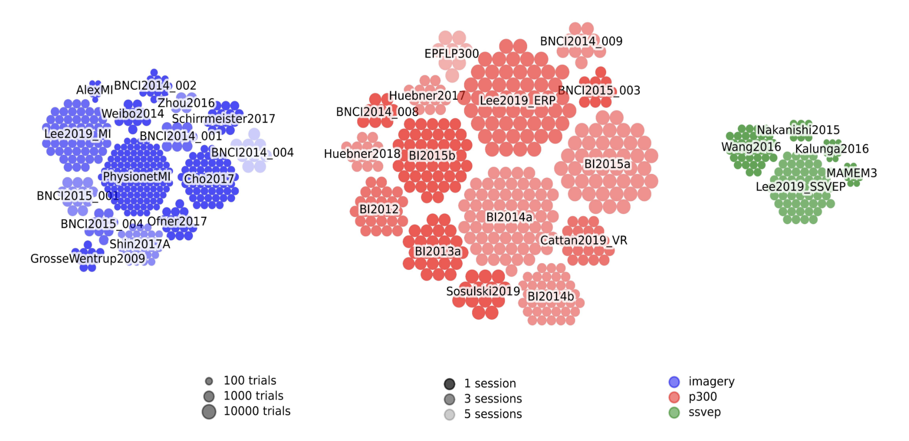

.. _data_summary:

.. automodule:: moabb.datasets

.. currentmodule:: moabb.datasets

Data Summary
======================

MOABB gather many datasets, here is list summarizing important information. Most of the
datasets are listed here but this list not complete yet, check API for complete
documentation.

Do not hesitate to help us complete this list. It is also possible to add new datasets,
there is a tutorial explaining how to do so, and we welcome warmly any new contributions!

It is possible to use an external dataset within MOABB as long as it is in Brain Imaging Data Structure (BIDS) format.
See this `guide <https://bids-specification.readthedocs.io/en/stable/#:~:text=The%20Brain%20Imaging%20Data%20Structure%20(BIDS)%20is%20a%20simple%20and,to%20help%20implement%20the%20standard.>`__ for more information on how to structure your data according to BIDS
You can use this `class <https://moabb.neurotechx.com/docs/api/generated/moabb.datasets.base.LocalBIDSDataset.html#moabb.datasets.base.LocalBIDSDataset>`__ to convert your local dataset to work within MOABB without creating a new dataset class.

See also `Datasets-Support <https://github.com/NeuroTechX/moabb/wiki/Datasets-Support>`__ for supplementary
detail on datasets (class name, size, licence, etc.)
Dataset, #Subj, #Chan, #Classes, #Trials, Trial length, Freq, #Session, #Runs, Total_trials, PapersWithCode leaderboard

Columns definitions:
    - **Dataset** is the name of the dataset.
    - **#Subj** is the number of subjects.
    - **#Chan** is the number of EEG channels.
    - **#Trials / class** is the number of repetitions performed by one subject for each class. This number is computed using only the first subject of each dataset. *The definitions of a **class** and of a **trial** depend on the paradigm used (see sections below)*.
    - **Trials length** is the duration of trial in seconds.
    - **Total_trials** is the total number of trials in the dataset (all subjects and classes together).
    - **Freq** is the sampling frequency of the raw data.
    - **#Session** is the number of sessions per subject. Different sessions are often recorded on different days.
    - **#Runs** is the number of runs per session. A run is a continuous recording of the EEG data. Often, the different runs of a given session are recorded without removing the EEG cap in between.
    - **PapersWithCode leaderboard** is the link to the dataset on the PapersWithCode leaderboard.

**Datasets overview:**

A visual overview of all datasets can be generated using the functions :func:`moabb.datasets.utils.plot_datasets_grid`
or :func:`moabb.datasets.utils.plot_datasets_cluster`.
This overview allows to quickly compare the number of subjects, trials, and sessions across different datasets.
The function will generate a figure like this:

Motor Imagery
======================

Motor Imagery is a BCI paradigm where the subject imagines performing movements. Each movement is associated with a different command to build an application.

Motor Imagery-specific definitions:
    - **#Classes** is the number of different imagery tasks.
    - **Trial** is one repetition of the imagery task.

.. csv-table::
   :file: ../build/summary_imagery.csv
   :header-rows: 1
   :class: sortable

P300/ERP
======================

ERP (Event-Related Potential) is a BCI paradigm where the subject is presented with a stimulus and the EEG response is recorded. The P300 is a positive peak in the EEG signal that occurs around 300 ms after the stimulus.

P300-specific definitions:
    - **A trial** is one flash.
    - **The classes** are binary: a trial is **target** if the key on which the subject focuses is flashed and **non-target** otherwise.

.. csv-table::
   :file: ../build/summary_p300.csv
   :header-rows: 1
   :class: sortable

SSVEP
======================

SSVEP (Steady-State Visually Evoked Potential) is a BCI paradigm where the subject is presented with flickering stimuli. The EEG signal is modulated at the same frequency as the stimulus. Each stimulus is flickering at a different frequency.

SSVEP-specific definitions:
    - **#Classes** is the number of different stimulation frequencies.
    - **A trial** is one symbol selection. This includes multiple flashes.

.. csv-table::
   :file: ../build/summary_ssvep.csv
   :header-rows: 1
   :class: sortable

c-VEP
======================

Include neuro experiments where the participant is presented with psuedo-random noise-codes,
such as m-sequences, Gold codes, or any arbitrary "pseudo-random" code. Specifically, the
difference with SSVEP is that SSVEP presents periodic stimuli, while c-VEP presents
non-periodic stimuli. For a review of c-VEP BCI, see:

Martínez-Cagigal, V., Thielen, J., Santamaria-Vazquez, E., Pérez-Velasco, S., Desain, P.,&
Hornero, R. (2021). Brain–computer interfaces based on code-modulated visual evoked
potentials (c-VEP): A literature review. Journal of Neural Engineering, 18(6), 061002.
DOI: https://doi.org/10.1088/1741-2552/ac38cf

c-VEP-specific definitions:
    - **A trial** is one symbol selection. This includes multiple flashes.
    - **#Trial classes** is the number of different symbols.
    - **#Epoch classes** is the number of possible intensities for the flashes  (for a visual cVEP paradigm). Typically, there are only two intensities: on and off.
    - **#Epochs / class** the number of flashes per intensity in each session.
    - **Codes** is the type of code used in the experiment.
    - **Presentation rate** is the rate at which the codes are presented.

.. csv-table::
   :file: ../build/summary_cvep.csv
   :header-rows: 1
   :class: sortable

Resting States
======================

Include neuro experiments where the participant is not actively doing something.
For example, recoding the EEG of a subject while s/he is having the eye closed or opened
is a resting state experiment.

.. csv-table::
    :file: ../build/summary_rstate.csv
    :header-rows: 1
    :class: sortable

Compound Datasets
======================

.. automodule:: moabb.datasets.compound_dataset

.. currentmodule:: moabb.datasets.compound_dataset

Compound Datasets are datasets compounded with subjects from other datasets.
It is useful for merging different datasets (including other Compound Datasets),
select a sample of subject inside a dataset (e.g. subject with high/low performance).

.. csv-table::
   :header: Dataset, #Subj, #Original datasets
   :class: sortable

   :class:`BI2014a_Il`,17,BI2014a
   :class:`BI2014b_Il`,11,BI2014b
   :class:`BI2015a_Il`,2,BI2015a
   :class:`BI2015b_Il`,25,BI2015b
   :class:`Cattan2019_VR_Il`,4,Cattan2019_VR
   :class:`BI_Il`,59,:class:`BI2014a_Il` :class:`BI2014b_Il` :class:`BI2015a_Il` :class:`BI2015b_Il` :class:`Cattan2019_VR_Il`

Submit a new dataset
~~~~~~~~~~~~~~~~~~~~

you can submit a new dataset by mentioning it to this
`issue <https://github.com/NeuroTechX/moabb/issues/1>`__. The datasets
currently on our radar can be seen `here <https://github.com/NeuroTechX/moabb/issues/1>`__,
but we are open to any suggestion.

If you want to actively contribute to inclusion of one new dataset, you can follow also this tutorial
`tutorial <https://neurotechx.github.io/moabb/auto_tutorials/tutorial_4_adding_a_dataset.html>`__.

.. raw:: html

   
   
