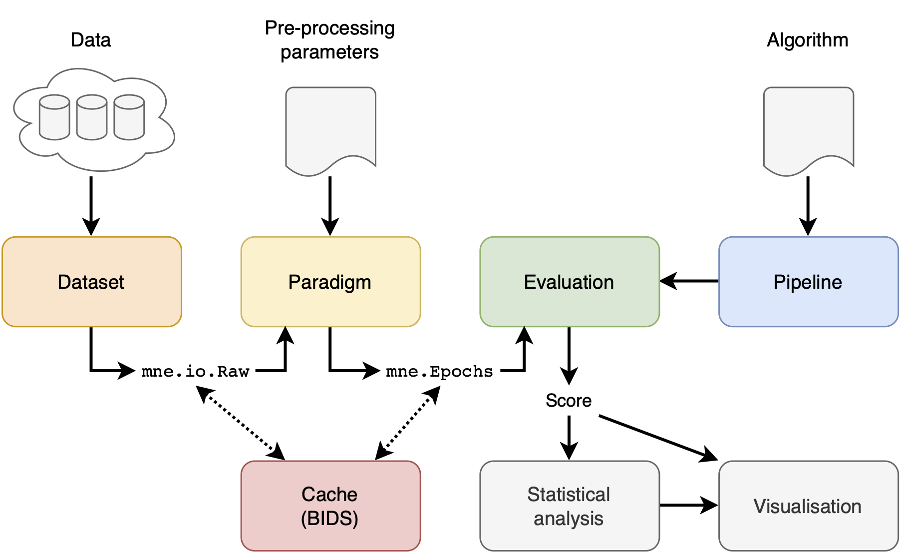

## Architecture and Main Concepts



There are 4 main concepts in the MOABB: the datasets, the paradigm, the evaluation, and
the pipelines. In addition, we offer statistical and visualization utilities to simplify
the workflow.

### Datasets

A dataset handles and abstracts low-level access to the data. The dataset will read data
stored locally, in the format in which they have been downloaded, and will convert them
into an MNE raw object. There are options to pool all the different recording sessions per
subject or to evaluate them separately.

### Paradigm

A paradigm defines how the raw data will be converted to trials ready to be processed by a
decoding algorithm. This is a function of the paradigm used, i.e. in motor imagery one can
have two-class, multi-class, or continuous paradigms; similarly, different preprocessing
is necessary for ERP vs ERD paradigms.

### Evaluations

An evaluation defines how we go from trials per subject and session to a generalization
statistic (AUC score, f-score, accuracy, etc) -- it can be either within-recording-session
accuracy, across-session within-subject accuracy, across-subject accuracy, or other
transfer learning settings.

### Pipelines

Pipeline defines all steps required by an algorithm to obtain predictions. Pipelines are
typically a chain of sklearn compatible transformers and end with a sklearn compatible
estimator. See
[Pipelines](http://scikit-learn.org/stable/modules/generated/sklearn.pipeline.Pipeline.html)
for more info.

### Statistics and visualization

Once an evaluation has been run, the raw results are returned as a DataFrame. This can be
further processed via the following commands to generate some basic visualization and
statistical comparisons:

```python
from moabb.analysis import analyze

results = evaluation.process(pipeline_dict)
analyze(results)
```
