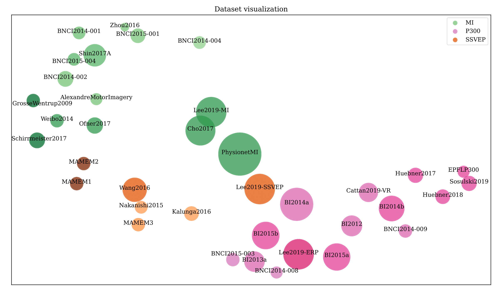

.. meta::
   :hide_sidebar: true

:html_theme.sidebar_secondary.remove:
:html_theme.sidebar_primary.remove:

.. _paper_results:
.. raw:: html

   <!-- Must import jquery before the datatables css and js files. -->
   
   <link rel="stylesheet" type="text/css" href="https://cdn.datatables.net/2.3.1/css/dataTables.dataTables.css">
   
   <link rel="stylesheet" type="text/css" href="https://cdn.datatables.net/fixedcolumns/5.0.4/css/fixedColumns.dataTables.css">
   
   

   

.. currentmodule:: moabb.datasets

The largest EEG-based Benchmark for Open Science
================================================

We report the results of the benchmark study performed in:
`The largest EEG-based BCI reproducibility study for open science: the MOABB benchmark <https://universite-paris-saclay.hal.science/hal-04537061v1/file/MOABB-arXiv.pdf>`_

   Visualization of the MOABB datasets, with Motor Imagery (MI) in green, ERP in pink/purple and SSVEP in orange/brown. The size of the circle is proportional to the number of subjects and the contrast depends on the number of electrodes.

This study conducts an extensive Brain-computer interfaces (BCI) reproducibility analysis on open electroencephalography datasets,
aiming to assess existing solutions and establish open and reproducible benchmarks for effective comparison within the field. Please note that the results are obtained using `Within-Session evaluation <http://moabb.neurotechx.com/docs/api/generated/moabb.evaluations.WithinSessionEvaluation.html>`_.
The results are reported regarding mean accuracy and standard deviation across all folds for all sessions and subjects.

If you use the same evaluation procedure, you should expect similar results if you use the same pipelines and datasets, with some minor variations due to the randomness of the cross-validation procedure.

**You can copy and use the table in your work**, but please `**cite the paper** <http://moabb.neurotechx.com/docs/cite.html>`_ if you do so.

Motor Imagery
=============

Motor Imagery is a BCI paradigm where the subject imagines performing a movement.
Each imagery task is associated with a different class, and each task has its difficulty level related to how the brain generates the signal.

Here, we present three different scenarios for Motor Imagery classification:

#. **Left vs Right Hand**: We use only the classes Left Hand and Right Hand.
#. **Right Hand vs Feet**: We use only Right Hand and Feet classes.
#. **All classes**: We use all the classes in the dataset, when there are more than classes that are not Left Hand and Right Hand.

All the results here are for **within-session evaluation**, a 5-fold cross-validation, over the subject's session.

Motor Imagery - Left vs Right Hand
===================================

**Left vs Right Hand**: We use only Left Hand and Right Hand classes.

.. raw:: html
   :file: results/within_session_mi_left_vs_right_hand.html

.. raw:: html

   

Motor Imagery - Right Hand vs Feet
==================================

**Right Hand vs Feet**: We use only Right Hand and Feet classes.

.. raw:: html
   :file: results/within_session_mi_right_hand_vs_feet.html

.. raw:: html

   

Motor Imagery - All classes
===========================

**All classes**: We use all the classes in the dataset, when there are more classes that are not Left Hand and Right Hand.

.. raw:: html
   :file: results/within_session_mi_all_classes.html

.. raw:: html

   

SSVEP (All classes)
===================

Here, we have the results of the within-session evaluation, a 5-fold cross-validation, over the subject's session.
We use all the classes available in the dataset.

.. raw:: html
   :file: results/within_session_ssvep_all_classes.html

.. raw:: html

   

P300/ERP (All classes)
======================

Here, we have the results of the within-session evaluation, a 5-fold cross-validation, over the subject's session.
We use all the classes available in the dataset.

.. raw:: html
   :file: results/within_session_erp_p300_all_classes.html

.. raw:: html

   

  

.. toctree::
   :glob:
   :hidden:
   :caption: MOABB Results
   :titlesonly:
